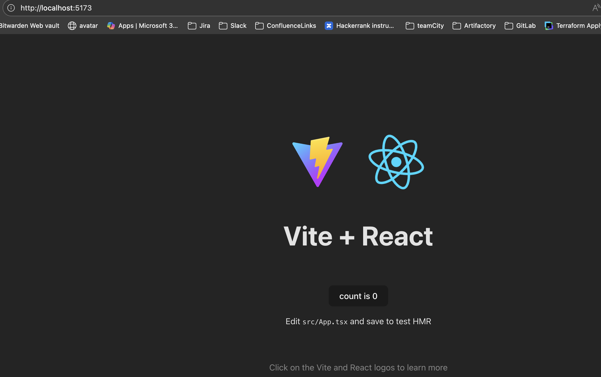

Setup Vite
- Docs: https://vite.dev/guide/
- Command: `npm create vite@latest`

My choices during setup
- Project name: `react-supa-fullstack`
- Framework: React
- Variant: TypeScript
- Use `rollup-vite` (experimental): No
- Install with npm and start now: Yes

Result
- Project created at `react-supa-fullstack/`
- Dependencies installed with npm

Install and run
- `npm install`
  - Added 50 packages, audited 226 packages
  - 45 packages looking for funding (`npm fund`)
  - 0 vulnerabilities found
- `npm run dev`
  - Vite re-optimized dependencies after lockfile change
  - Dev server ready at `http://localhost:5173/`

