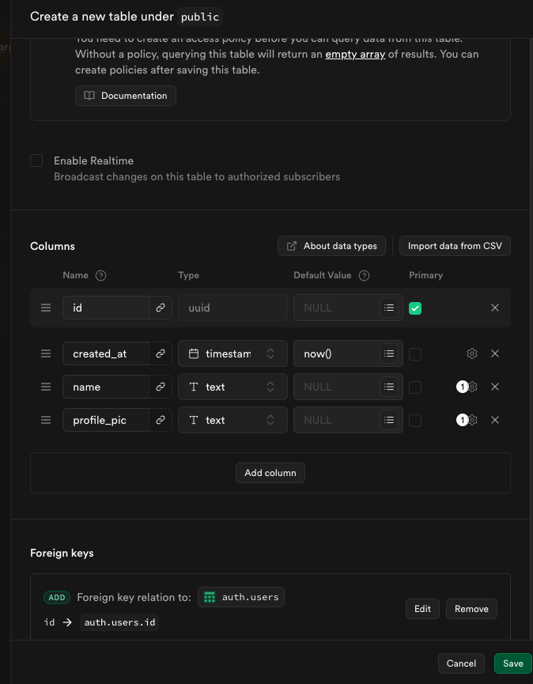
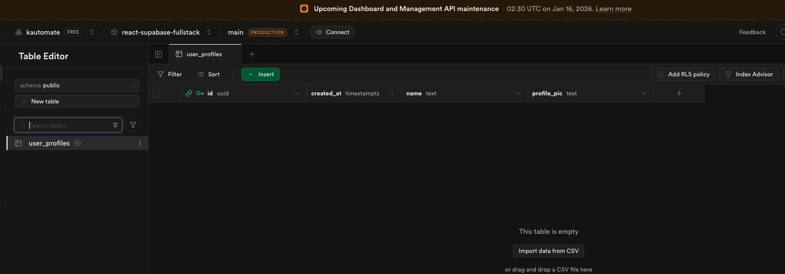
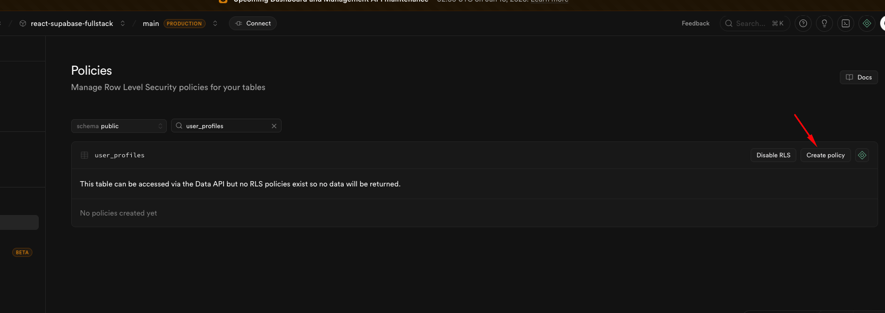
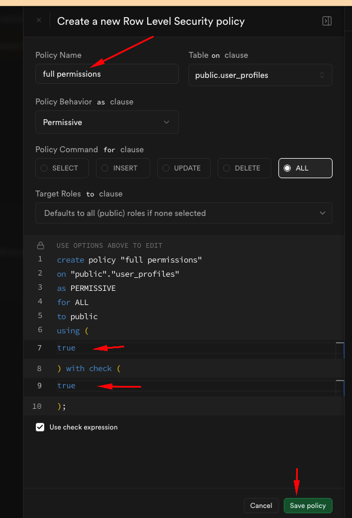

Setup Vite
- Docs: https://vite.dev/guide/
- Command: `npm create vite@latest`

My choices during setup
- Project name: `react-supa-fullstack`
- Framework: React
- Variant: TypeScript
- Use `rollup-vite` (experimental): No
- Install with npm and start now: Yes

Result
- Project created at `react-supa-fullstack/`
- Dependencies installed with npm

Install and run
- `npm install`
  - Added 50 packages, audited 226 packages
  - 45 packages looking for funding (`npm fund`)
  - 0 vulnerabilities found
- `npm run dev`
  - Vite re-optimized dependencies after lockfile change
  - Dev server ready at `http://localhost:5173/`


Add Tailwind (Vite guide)
- Installed: `npm install tailwindcss @tailwindcss/vite`
- Updated config: `react-supa-fullstack/vite.config.ts`
  ```ts
  import { defineConfig } from 'vite'
  import react from '@vitejs/plugin-react'
  import tailwindcss from '@tailwindcss/vite'

  export default defineConfig({
    plugins: [
      tailwindcss(),
      react()
    ],
  })
  ```
- Rationale: the `@tailwindcss/vite` plugin injects Tailwind’s processing into Vite’s build; placing it before `react()` ensures styles are handled before React’s plugin runs.

Add Ant Design UI
- Installed: `npm install antd`
- Use named imports (curly braces) per Ant Design docs:
  ```tsx
  import { Button } from "antd";
  ```
- `react-supa-fullstack/src/App.tsx` test:
  ```tsx
  import { Button } from "antd";

  function App() {
    return (
      <div className="p-5 font-bold flex flex-col gap-5">
        <h1>App Component In Homepage</h1>
        <Button>AntD Default Button</Button>
        <Button type="primary">AntD Primary Button</Button>
      </div>
    )
  }

  export default App;
  ```

AntD theme provider test
- Created folder: `react-supa-fullstack/src/theme/`
- File: `react-supa-fullstack/src/theme/index.tsx`
  ```tsx
  import React from "react";
  import { ConfigProvider } from "antd";

  function ThemeProvider({ children }: { children: React.ReactNode }) {
    const primaryColorCode = '#000'
    return (
      <ConfigProvider
        theme={{
          token: {
            colorPrimary: primaryColorCode,
            controlOutline: 'none',
          }, // global tokens (colors, radius, fonts, etc.)
          components: {
            Button: { controlHeight: 45 },
            Input: { controlHeight: 45, colorBorder: 'gray' },
          }, // component-specific tokens/overrides
        }}
      >
        {children}
      </ConfigProvider>
    )
  }

  export default ThemeProvider;
  ```
- Wrapped `App` with `ThemeProvider` to centralize future theme customizations:
  ```tsx
  import { Button, Input } from "antd";
  import ThemeProvider from "./theme";

  function App() {
    return (
      <ThemeProvider>
        <div className="p-5 font-bold flex flex-col gap-5">
          <h1>App Component In Homepage</h1>
          <Button>AntD Default Button</Button>
          <Button type="primary">AntD Primary Button</Button>
          <Input placeholder="Antd Input" />
        </div>
      </ThemeProvider>
    )
  }

  export default App;
  ```
- Concept: AntD exposes theming via `ConfigProvider` and `theme` object.
  - `theme.token`: global design tokens (e.g., `colorPrimary`, `borderRadius`, typography). They cascade to all components.
  - `theme.components`: per-component overrides (e.g., `Button.controlHeight`, `Input.colorBorder`) to tweak a specific component without changing everything.
  - Docs: https://ant.design/docs/react/customize-theme
  - Visual editor for experimentation: https://ant.design/theme-editor
  - You can also set `algorithm` (default/dark) and other tokens for broader theming later.

Routing setup
- Installed: `npm install react-router-dom`
- Created `src/pages/` with three route components:
  - `src/pages/home/index.tsx`
    ```tsx
    function HomePage() {
      return (
        <div>HomePage</div>
      )
    }

    export default HomePage
    ```
  - `src/pages/login/index.tsx`
    ```tsx
    function LoginPage() {
      return (
        <div>LoginPage</div>
      )
    }

    export default LoginPage
    ```
  - `src/pages/register/index.tsx`
    ```tsx
    function RegisterPage() {
      return (
        <div>RegisterPage</div>
      )
    }

    export default RegisterPage
    ```
- Wired routes in `src/App.tsx` using `BrowserRouter`/`Routes`/`Route`:
  ```tsx
  import HomePage from "./pages/home";
  import LoginPage from "./pages/login";
  import RegisterPage from "./pages/register";
  import ThemeProvider from "./theme";
  import { BrowserRouter, Routes, Route } from "react-router-dom";

  function App() {
    return (
      <ThemeProvider>
        <BrowserRouter>
          <Routes>
            <Route path="/" element={<HomePage />} />
            <Route path="/login" element={<LoginPage />} />
            <Route path="register" element={<RegisterPage />} />
          </Routes>
        </BrowserRouter>
      </ThemeProvider>
    )
  }

  export default App;
  ```
- Enhanced `RegisterPage` with AntD form + Tailwind layout and a login link:
  - Imports: `Form`, `Input`, `Button` from `antd`; `Link` from `react-router-dom`
  - Layout: centered card with padding, rounded corners, and border/shadow
  - Form fields: Name, Email, Password (`Input.Password`)
  - Actions: Primary `Register` button + link to `/login`
- Enhanced `LoginPage` with AntD form + Tailwind layout and a register link (`src/pages/login/index.tsx`):
  ```tsx
  import { Form, Input, Button } from "antd";
  import { Link } from "react-router-dom";

  function LoginPage() {
    const onFinish = (values: any) => { console.log("Received Form Values", values); };
    return <div className="bg-gray-200 h-screen flex justify-center items-center">
        <div className="bg-white border border-gray-300 shadow-sm p-5 rounded w-105 ">
            <h1 className="text-xl font-bold">
                Login
            </h1>
            <p className="text-sm font-semibold text-gray-500 mb-5">
                Welcome ! Enter Credentials to Login
            </p>
            <hr className="border-gray-300 my-5" />
            <Form onFinish={onFinish} layout="vertical" className="flex flex-col gap-5" autoComplete="off">
                <Form.Item
                    label="Email"
                    name="email"
                    rules={[{
                        required: true,
                        message: 'Please input your Email address'
                    }]}>
                    <Input placeholder="Email ID" />

                </Form.Item>
                <Form.Item
                    label="Password"
                    name="password"
                    rules={[{
                        required: true,
                        message: 'Password'
                    }]}>
                    <Input.Password placeholder="Email ID" />

                </Form.Item>
                <Button htmlType="submit" block type="primary" className="mb-3">
                    Login
                </Button>
                <span className="text-sm font-semibold ">
                    Don't have an account?{" "} <Link to='/register'>Register</Link>
                </span>
            </Form>
        </div>
    </div>
  }

  export default LoginPage
  ```
  - `Link` from `react-router-dom` performs client-side navigation between `/login` and `/register` without a full page reload, keeping SPA state intact.

Supabase setup
- Created new Supabase account/org/project.
- Installed SDK: `npm install @supabase/supabase-js`.
- Env vars in `.env`:
  - `VITE_SUPABASE_URL=<project-url>`
  - `VITE_SUPABASE_PUBLISHABLE_KEY=<anon-public-key>`
- Config file: `react-supa-fullstack/src/config/supabase-config.ts`
  ```ts
  import { createClient } from '@supabase/supabase-js'

  // Create a single supabase client for interacting with your database
  const supabaseUrl = import.meta.env.VITE_SUPABASE_URL;
  const supabaseKey = import.meta.env.VITE_SUPABASE_PUBLISHABLE_KEY;

  const supabase = createClient(supabaseUrl, supabaseKey)
  ```
- Reference: https://supabase.com/docs/reference/javascript/initializing

Supabase Auth (password) + UX helpers
- Register flow in `src/pages/register/index.tsx`:
  - Imports Supabase client (`supabaseConfig`), React state, router, and AntD message: `useState`, `useNavigate`, `message.useMessage()`.
  - `const [loading, setLoading] = useState(false);` tracks submit state to block duplicate requests and show loading.
  - `const navigate = useNavigate();` lets you redirect after success (e.g., `navigate('/login')`).
  - `const [messageApi, contextHolder] = message.useMessage();` gives you toast helpers; render `{contextHolder}` in JSX so messages can mount.
  - Submit handler uses `supabaseConfig.auth.signUp` with the email/password values, shows `messageApi.success` or `messageApi.error`, then navigates to `/login`.
  - AntD button uses `loading={loading}` to show a spinner and `disabled={loading}` to prevent clicks while the async request runs.
- Login flow in `src/pages/login/index.tsx`:
  - Uses `loginUser` service (see Services layer) which calls `supabase.auth.signInWithPassword`.
  - UI: AntD `Form`, `Input`, `Button`; `message.useMessage()` for toasts; `useNavigate` to redirect on success.
  - Success handler shows a toast (`messageApi.open({ type: "success", ... })`) and navigates to `/` on close; errors use `messageApi.error`.
  - Button ties to loading state: `loading={loading}` spins and `disabled={loading}` blocks extra clicks during the async call.

Supabase custom attributes (profiles table)
- In Supabase (Table editor), created `public.user_profiles` with columns:
  - `id` `uuid` (primary key) — foreign key to `auth.users.id`
  - `created_at` `timestamp` default `now()`
  - `email` `text` (unique)
  - `name` `text`
  - `profile_pic` `text`
- Foreign key: `id -> auth.users.id` to keep profile rows tied to Supabase users.
- Screenshots: 
- RLS: enabled Row Level Security and added policies (screenshots below) so authenticated users can insert/select their own row (`auth.uid() = id`).
  - 
  - 
  - 
- After signup, insert profile row in `user_profiles` (`src/pages/register/index.tsx`):
  ```tsx
  const userId = signupResponse.data.user?.id
  const userProfilesTableData = {
    id: userId,
    name: values.name,
    profile_pic: ''
  }
  const userProfileResponse = await supabaseConfig
    .from('user_profiles')
    .insert([userProfilesTableData])
  if (userProfileResponse.error) {
    throw new Error(userProfileResponse.error.message);
  }
  ```
- New signup guards and persistence (services layer)
  - Added unique `email` column to `user_profiles`; set unique constraint in Supabase to prevent duplicates.
  - In `src/services/users.ts`, check for existing email before sign up:
    ```ts
    const userExistingResponse = await supabaseConfig
      .from('user_profiles')
      .select('*')
      .eq('email', values.email)
    if (userExistingResponse.data && userExistingResponse.data.length > 0) {
      throw new Error("Email already registered. Please login");
    }
    ```
  - Profile insert now stores email along with id/name/profile_pic:
    ```ts
    const userProfilesTableData = {
      id: userId,
      email: values.email,
      name: values.name,
      profile_pic: ''
    }
    await supabaseConfig.from('user_profiles').insert([userProfilesTableData])
    ```

Services layer
- File: `react-supa-fullstack/src/services/users.ts`
- Purpose: keep Supabase auth + profile creation logic out of React components for reuse and cleaner UI code.
- Current exports:
  ```ts
  import supabaseConfig from "../config/supabase-config";

  export const registerUser = async (values: any) => {
    try {
      // check if the email is already registered
      const userExistingResponse = await supabaseConfig
        .from('user_profiles')
        .select('*')
        .eq('email', values.email)
      if (userExistingResponse.data && userExistingResponse.data.length > 0) {
        throw new Error("Email already registered. Please login");
      }
      const signupResponse = await supabaseConfig.auth.signUp({
        email: values.email,
        password: values.password
      })
      if (signupResponse.error) {
        throw new Error(signupResponse.error.message)
      }
      const userId = signupResponse.data.user?.id
      const userProfilesTableData = {
        id: userId,
        email: values.email,
        name: values.name,
        profile_pic: ''
      }
      const userProfileResponse = await supabaseConfig.from('user_profiles').insert([userProfilesTableData])
      if (userProfileResponse.error) {
        throw new Error(userProfileResponse.error.message);
      }
      return {
        success: true,
        message: "Registration successful. Please check your Email to verify"
      }
    } catch (error: any) {
      throw new Error(error.message || "Something went wrong")
    }
  }

  export const loginUser = async (values: any) => {
    try {
      const loginResponse = await supabaseConfig.auth.signInWithPassword({
        email: values.email,
        password: values.password
      })
      if (loginResponse.error) {
        throw new Error(loginResponse.error.message);
      }
      return { success: true, message: "Login successful" }
    } catch (error: any) {
      throw new Error(error.message || "Something went wrong");
    }
  }
  ```
- Usage in components: call `registerUser(values)` from Register and `loginUser(values)` from Login; handle success/error with AntD `messageApi` + `navigate`, while keeping network/auth logic centralized here.

Styles after cleanup
- Removed `react-supa-fullstack/src/App.css`
- Global stylesheet: `react-supa-fullstack/src/index.css`
- Current globals in `index.css`:
  - Imports Montserrat from Google Fonts
  - Imports Tailwind (`@tailwindcss/vite` plugin is configured in Vite)
  - Applies `font-family: "Montserrat", sans-serif;` to all elements
  - Applies `box-sizing: border-box;` to all elements

Edit the default app
- Start with `react-supa-fullstack/src/App.tsx`
- Tailwind test (using utility classes):
  ```tsx
  function App() {
    return (
      <div className="p-5 bg-gray-200 font-bold">
        App Kiran ChilledOut
      </div>
    )
  }

  export default App;
  ```

Component vs. styles
- `App.tsx` is the root component Vite mounts; with `App.css` removed, it now relies on global styles.
- `index.css` is global; it’s loaded in `main.tsx` and now handles fonts, Tailwind, and box sizing for the entire document.
- You can create other components (e.g., `App1.tsx` + `App1.css`), but only the component rendered in `main.tsx` is mounted at `#root`. Swap `App` for another component there if you want a different entry point.

Differences vs. Lovable project (`rg-techshop-we-prod`)
- Pages structure:
  - Folder-per-page: `src/pages/home/index.tsx` (scales when a page needs its own styles, hooks, subcomponents).
  - Flat pages: `src/pages/Home.tsx` (simpler for small apps).
  - There is no single standard; teams choose based on project size. The folder-per-page approach is more scalable once pages grow.
- Tailwind setup:
  - `react-supa-fullstack` uses `@tailwindcss/vite` in `react-supa-fullstack/vite.config.ts` and `@import "tailwindcss";` in `react-supa-fullstack/src/index.css`.
  - `rg-techshop-we-prod` uses PostCSS config (`postcss.config.js`) and classic `@tailwind base; @tailwind components; @tailwind utilities;` in `rg-techshop-we-prod/src/index.css`.
- Auth/invite UI:
  - `rg-techshop-we-prod/src/pages/Auth.tsx` uses shadcn/ui components, Zod validation, and a dialog to invite users via `supabase.functions.invoke('send-invite', ...)`.
  - This project uses AntD components and can handle validation either with AntD `Form` rules or your own schema logic.
